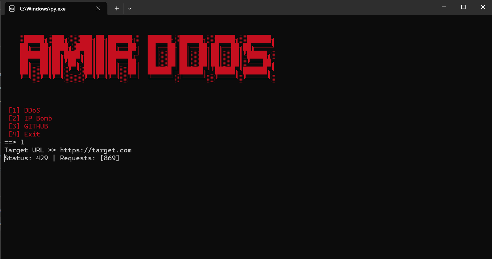

[](https://git.io/typing-svg)

# ADDoS

Educational cybersecurity application built with Python

For educational purposes only. Author not responsible for misuse.

```bash
pip install -r requirements.txt
```

```bash
python ADDoS.py
```
Or use 

```bash
python launch.py
```

## requirements.txt

```bash
aiohttp
colorama
pystyle
```
## Exe file

```bash
The finished EXE file.
You can open it without
Downloading the libraries.
```
## Preview

<p align="center">
  
</p>

**ADDoS - Educational project**
